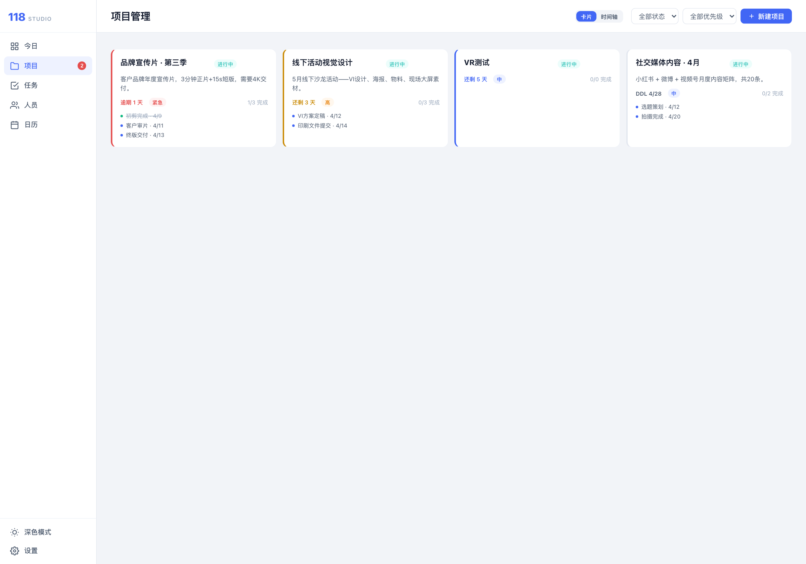
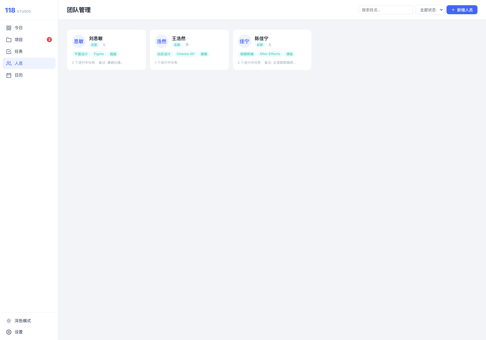
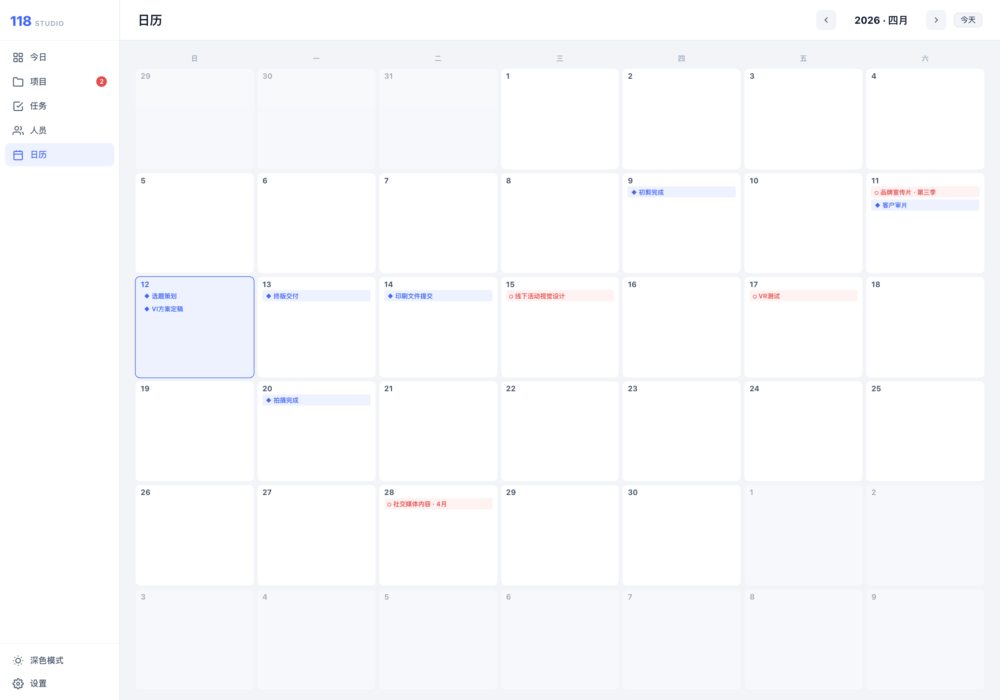
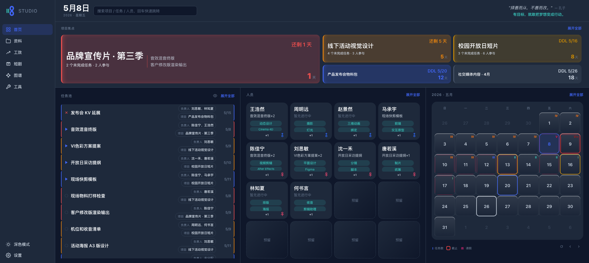

# 118 Studio Manager

A local-first project collaboration tool built for 118 Studio — designed around daily focus, not dashboards bloat.

**Live demo:** [118.fishknowsss.com](https://118.fishknowsss.com/) &nbsp;·&nbsp; **Branch:** `vc`

---

## Screenshots

| Dashboard | Projects |
|---|---|
|  |  |

| Tasks | People |
|---|---|
|  |  |

| Calendar | Settings |
|---|---|
|  |  |

<details>
<summary>Dark mode</summary>



</details>

---

## Features

- **Today Dashboard** — focus project stack, task pool, people workload, and mini calendar in one view
- **Project Management** — status, priority, deadlines, milestones, and a visual timeline
- **Task Management** — filter/search, right-click context menu for quick status/assignee/priority updates
- **People Management** — member profiles, active/inactive toggle, task associations, skill tags
- **Calendar View** — monthly grid with deadline and milestone markers; click any day to open its schedule panel
- **Data Management** — JSON/CSV export, JSON import, full wipe with confirmation
- **Cloud Sync (optional)** — two-way sync between local IndexedDB and a Cloudflare Worker/KV backend

---

## Tech Stack

| Layer | Technology |
|---|---|
| UI | React 19 + TypeScript |
| Build | Vite |
| Local storage | IndexedDB (`studio118db`) |
| Cloud sync | Cloudflare Worker + KV |
| Deployment | GitHub Pages |
| Testing | Vitest + jsdom |
| Linting | ESLint |

---

## Getting Started

**Requirements**

- Node.js `24.14.1` (pinned via `volta` in `package.json`)
- npm `11.11.0`

**Install and run**

```bash
npm install
npm run dev
```

Default dev server: `http://127.0.0.1:5173/`

macOS one-click start:

```bash
./118-start.command
```

**Common commands**

```bash
npm run lint      # ESLint
npm run test      # Vitest
npm run build     # TypeScript check + Vite build
npm run preview   # Preview the production build locally
```

---

## Architecture

The app uses a **React view layer** on top of a **legacy data layer** — separating UI concerns from state management.

```
src/
├── main.tsx / App.tsx     # Entry point and app shell
├── views/                 # Page-level components (one per route)
├── features/              # Domain feature components (dashboard, projects, tasks…)
├── components/            # Shared UI and feedback primitives
├── content/               # Static content (quotes, etc.)
└── legacy/
    ├── store.ts           # In-memory state, subscriptions
    ├── actions.ts         # State mutations
    ├── selectors.ts       # Derived state / computed models
    ├── db.ts              # IndexedDB read/write
    └── …
```

**Key design points:**
- State lives in `legacy/store` (in-memory), connected to React via `useSyncExternalStore`
- IndexedDB persists all data locally (no backend required for core functionality)
- Selectors in `legacy/selectors.ts` centralize derived state calculations
- On first launch with an empty database, the app attempts a cloud restore, then falls back to demo data

### Routes (hash router)

| Hash | View | Description |
|---|---|---|
| `#dashboard` | Today | Focus projects, task pool, people panel, mini calendar |
| `#projects` | Projects | Card and timeline view with quick status actions |
| `#tasks` | Tasks | Searchable task list with context menu shortcuts |
| `#people` | People | Member management and task associations |
| `#calendar` | Calendar | Monthly deadline/milestone overview |
| `#settings` | Settings | Import/export, cloud sync, logs |

---

## Cloud Sync

Cloud sync is optional and requires a deployed Cloudflare Worker.

**Setup**

1. Create a KV Namespace in your Cloudflare account.
2. Update `cloudflare/sync-worker/wrangler.toml` with your KV Namespace ID.
3. Set `ALLOWED_ORIGIN` to your frontend domain.
4. Deploy with Wrangler.
5. Set the `VITE_SYNC_API_URL` environment variable to your Worker URL:

```bash
# .env (not committed — see .env.example)
VITE_SYNC_API_URL=https://sync.example.com
```

**Sync behavior**

| Trigger | Action |
|---|---|
| Data change | Auto-upload ~2 minutes after last change |
| Manual sync | Immediate upload + local JSON backup download |
| Cloud restore | Overwrites local IndexedDB with cloud snapshot |
| Boot (empty DB) | Automatically pulls latest cloud snapshot if available |

The Worker exposes three endpoints: `GET /meta`, `GET /data`, `PUT /data`. Only one snapshot (`sync:current`) is kept in KV at a time.

See [`cloudflare/sync-worker/`](cloudflare/sync-worker/) for full setup details.

---

## Data Structure

All data is persisted in IndexedDB under the database name `studio118db`.

| Store | Contents |
|---|---|
| `projects` | Project records: status, priority, deadline, milestones |
| `tasks` | Tasks: assignees, schedule, status |
| `people` | Members: skills, active state |
| `logs` | Operation log (last 50 entries) |
| `settings` | Local settings |

JSON export format (schema v2):

```jsonc
{
  "schemaVersion": 2,
  "exportedAt": "…",
  "projects": […],
  "tasks": […],
  "people": […],
  "logs": […],
  "settings": {…}
}
```

---

## Deployment

Deployments are handled by GitHub Actions ([`.github/workflows/deploy.yml`](.github/workflows/deploy.yml)).

| Branch | Deployed path | URL |
|---|---|---|
| `vc` | `/` (root) | https://118.fishknowsss.com/ |
| `main` | `/v1/` | https://118.fishknowsss.com/v1/ |
| `singleD` | `/singleD/` | https://118.fishknowsss.com/singleD/ |

The build base path is injected via the `DEPLOY_BASE` environment variable (see `vite.config.ts`).

To enable cloud sync on GitHub Pages, add `VITE_SYNC_API_URL` as a repository Actions Variable.

---

## Branch Strategy

| Branch | Role | Status |
|---|---|---|
| `vc` | **Main development branch** | Active |
| `main` | Legacy v1 | Archived, no active development |
| `singleD` | Legacy single-page variant | Archived, no active development |

All new development happens on `vc`.

---

## Testing

Tests live in `tests/` and use Vitest + jsdom.

```bash
npm run lint && npm run test && npm run build
```

Run all three before submitting changes.
