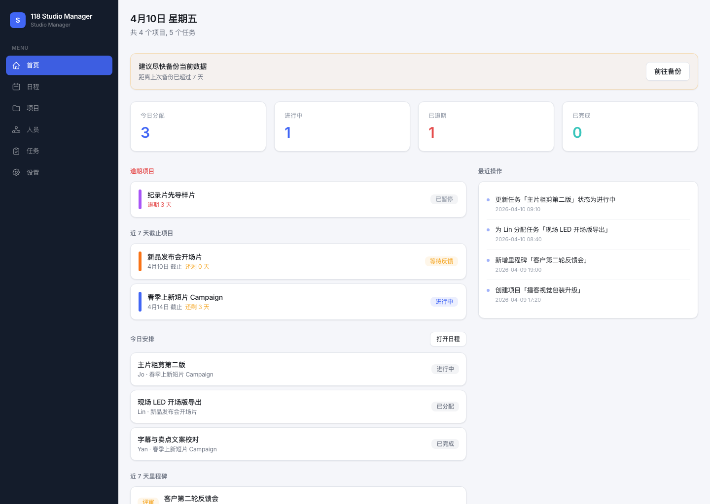
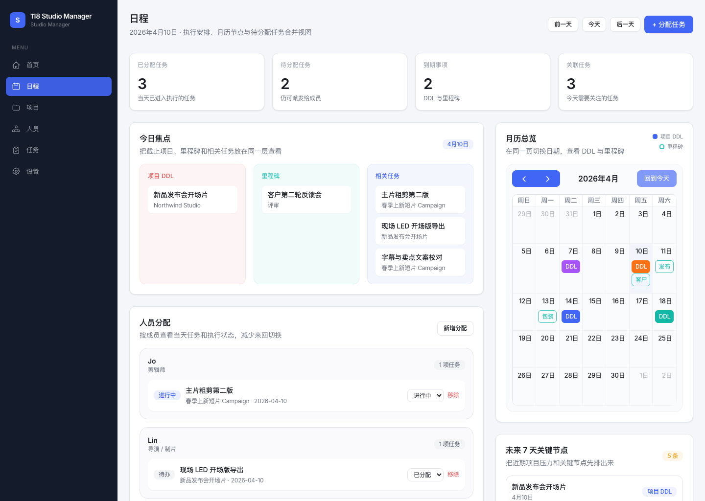
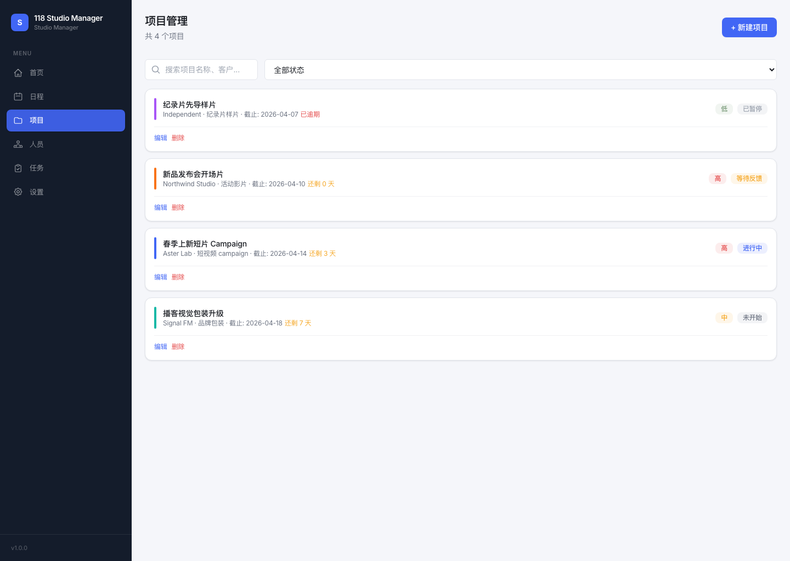
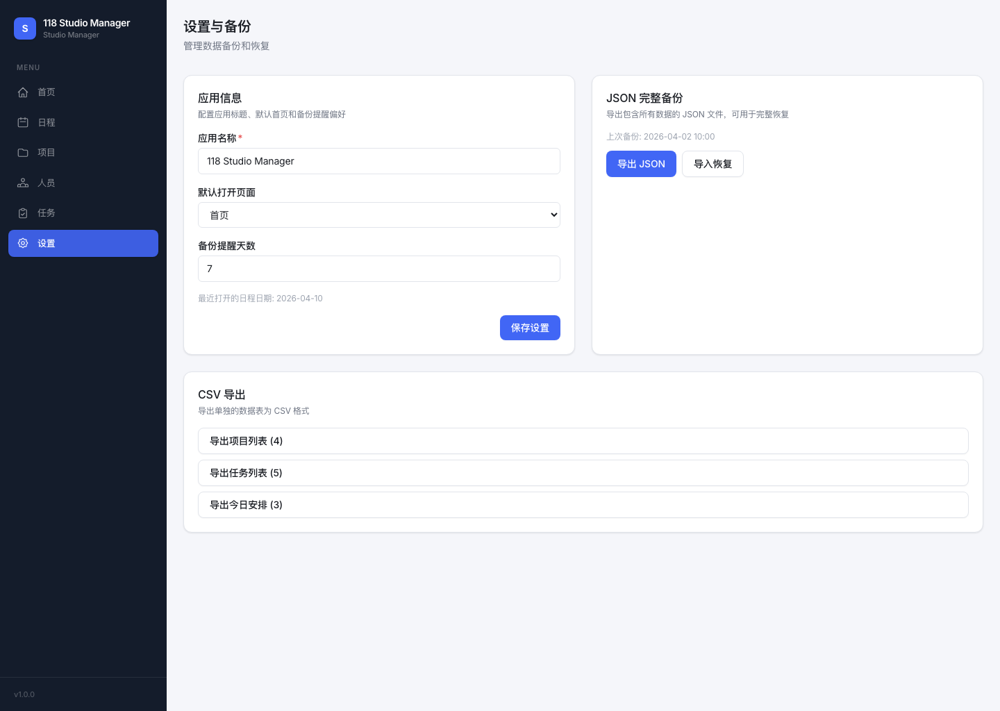
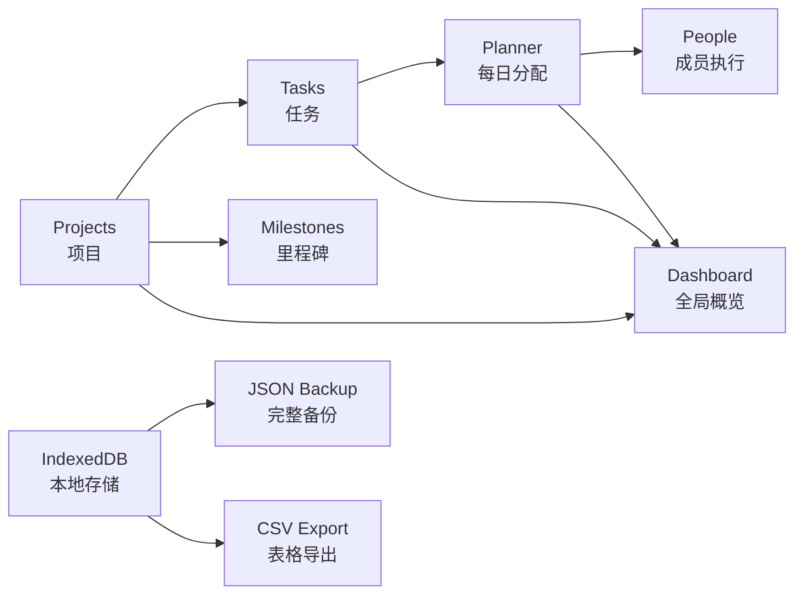

<div align="center">
  <h1>118 Studio Manager</h1>
  <p>为小型工作室与内容团队准备的本地优先运营管理台</p>

  <p>
    
    
    
    
    
    
  </p>

  <p>
    <a href="https://fishknowsss.github.io/118-Studio-Manager/">在线预览</a> ·
    <a href="https://github.com/fishknowsss/118-Studio-Manager">GitHub 仓库</a>
  </p>

  <p>
    <a href="#项目定位">项目定位</a> ·
    <a href="#界面预览">界面预览</a> ·
    <a href="#功能全景">功能全景</a> ·
    <a href="#快速开始">快速开始</a> ·
    <a href="#版本更新记录">版本更新</a>
  </p>
</div>

## 项目定位

> `118 Studio Manager` 把项目、任务、成员、排期、里程碑与备份整理到同一个浏览器工作台里。
> 它不依赖后端、不需要登录，适合希望快速落地流程、同时又想保留本地数据掌控权的小型团队与个人工作室。

<table>
  <tr>
    <td width="50%" valign="top">
      <h3>适合谁</h3>
      <p>内容制作工作室、视频团队、自由职业者、轻量项目协作团队。</p>
    </td>
    <td width="50%" valign="top">
      <h3>解决什么问题</h3>
      <p>把“项目推进”“任务拆分”“成员分配”“每日执行”从零散表格整合成一个统一视图。</p>
    </td>
  </tr>
  <tr>
    <td width="50%" valign="top">
      <h3>核心特点</h3>
      <p>本地优先、结构清晰、启动成本低、适合持续迭代。</p>
    </td>
    <td width="50%" valign="top">
      <h3>使用体验</h3>
      <p>打开即用，支持 JSON 完整备份、CSV 导出、GitHub Pages 发布。</p>
    </td>
  </tr>
</table>

## 在线预览

- 线上地址: [https://fishknowsss.github.io/118-Studio-Manager/](https://fishknowsss.github.io/118-Studio-Manager/)
- 仓库地址: [https://github.com/fishknowsss/118-Studio-Manager](https://github.com/fishknowsss/118-Studio-Manager)
- 说明: 线上版本适合快速浏览结构与交互；本地运行更适合长期使用与数据管理。

## 界面预览

以下截图基于本地演示数据生成，展示的是当前项目里的真实界面。

<table>
  <tr>
    <td width="50%" valign="top">
      
      <p><strong>Dashboard</strong><br/>首页集中展示今日分配、逾期项目、近 7 天截止事项与最近操作。</p>
    </td>
    <td width="50%" valign="top">
      
      <p><strong>Daily Planner</strong><br/>把单日任务、成员分配、月历节点与未来 7 天关键事项放进同一视图。</p>
    </td>
  </tr>
  <tr>
    <td width="50%" valign="top">
      
      <p><strong>Projects</strong><br/>按截止时间、优先级与状态管理项目，适合快速识别紧急程度。</p>
    </td>
    <td width="50%" valign="top">
      
      <p><strong>Settings & Backup</strong><br/>集中管理应用名称、默认视图、JSON 备份恢复与 CSV 导出。</p>
    </td>
  </tr>
</table>

## 功能全景

| 模块 | 能做什么 | 价值 |
| --- | --- | --- |
| 仪表盘 | 查看今日任务、逾期项目、近期截止与最近操作 | 一眼看到当前工作室状态 |
| 项目管理 | 创建项目、设置截止时间、优先级、客户来源与颜色标识 | 让项目列表具备可读性和紧迫度排序 |
| 任务管理 | 维护任务状态、优先级与所属项目 | 从项目目标细化到执行单元 |
| 人员管理 | 维护成员资料并关联任务分配 | 让“谁在做什么”可追踪 |
| 日程 Planner | 在单日视图中组合任务、成员、里程碑与项目 DDL | 把执行安排真正落到每天 |
| 里程碑与日历 | 汇总关键节点与项目截止事项 | 降低遗漏与延期风险 |
| 设置与备份 | JSON 完整备份/恢复、CSV 导出、默认视图设置 | 保证数据安全，也方便交接 |

## 界面与数据流



## 技术栈

| 类别 | 选型 |
| --- | --- |
| 前端框架 | React 19 |
| 语言 | TypeScript |
| 构建工具 | Vite 8 |
| 样式系统 | Tailwind CSS 4 |
| 路由 | React Router |
| 本地数据库 | Dexie + IndexedDB |
| 日历能力 | FullCalendar |
| 日期处理 | Day.js |
| 部署 | GitHub Pages + GitHub Actions |

## 快速开始

### 本地开发

```bash
npm install
npm run dev
```

浏览器打开 `http://127.0.0.1:5173/` 即可。

### macOS 一键启动

如果你希望像桌面工具一样直接运行，可以在 Finder 中双击：

- `start-local.command`：自动安装依赖、启动本地服务并打开浏览器
- `stop-local.command`：停止本地开发服务

也可以用命令行执行：

```bash
npm run start:local
npm run stop:local
```

## 项目结构

```text
src/
  components/   可复用 UI 组件
  pages/        页面级视图
  hooks/        数据读取与状态逻辑
  services/     备份、导出、业务操作
  db/           Dexie 数据库定义
  constants/    常量映射与导航配置
  types/        业务类型定义
  utils/        日期、CSV、校验、排序等工具
docs/
  screenshots/  README 展示截图
```

## 数据与备份

- 数据默认保存在浏览器的 `IndexedDB` 中，适合本地独立使用。
- 支持导出完整 `JSON` 备份，可在新环境中恢复全部数据。
- 支持导出项目、任务、日程安排的 `CSV` 文件，方便归档或交给表格工具处理。
- 设置页内提供备份提醒，降低长期使用后的数据风险。

## 质量检查

```bash
npm run lint
npm run build
```

## 版本更新记录

以下记录根据仓库当前演进整理，便于快速了解项目变化。

| 版本 | 日期 | 更新内容 |
| --- | --- | --- |
| v0.3.0 | 2026-04-10 | 日程页合并月历与分配视图；README 升级为展示型文档，加入真实截图、在线预览与更新记录 |
| v0.2.0 | 2026-04-09 | 修复 GitHub Pages 下的设置初始化问题，完善部署可用性 |
| v0.1.0 | 2026-04-09 | 完成首版工作室管理台，包含项目、任务、人员、日程、备份与导出能力 |

## 部署到 GitHub Pages

项目已经为 GitHub Pages 做了适配：

1. 打开仓库的 `Settings`。
2. 进入 `Pages`。
3. 将部署来源设置为 `GitHub Actions`。
4. 推送到 `main` 分支后触发构建与发布。

生产环境已配置 GitHub Pages 的基础路径，并使用 Hash Router，深链接在部署后仍然可用。
