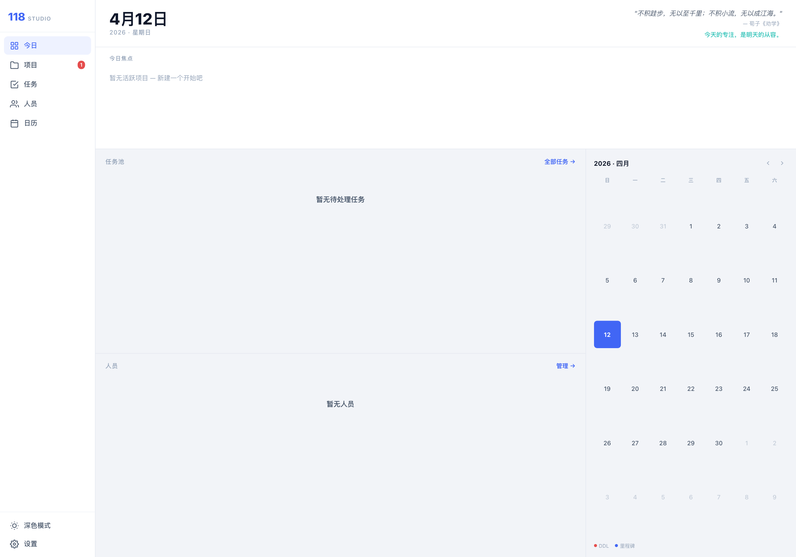
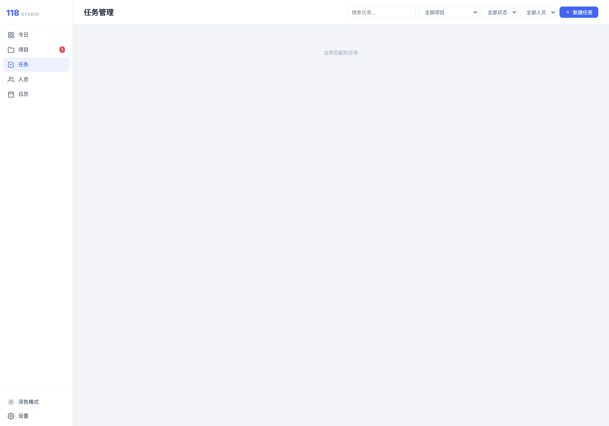
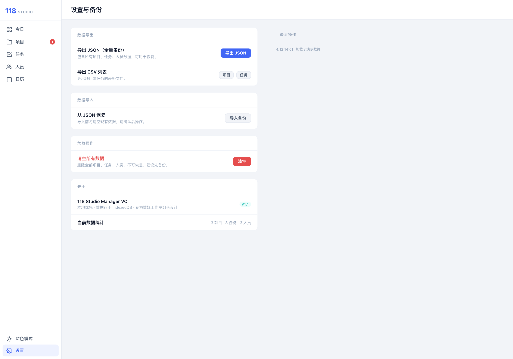

# 118 Studio Manager VC

`vc` 是我给 118 Studio Manager 留的一条过渡分支。

这条线不是 `main` 的正式版本，也不是 `singleD` 的单屏版本，而是一个已经切到 `React + Vite` 外壳、但底层仍保留 legacy 数据层和交互模块的迁移中版本。它的价值不在于“功能最全”，而在于这套混合结构现在还能稳定跑、还能继续拆和迁。

## 在线预览

- 预览地址：[https://fishknowsss.github.io/118-Studio-Manager/vc/](https://fishknowsss.github.io/118-Studio-Manager/vc/)
- 分支地址：[https://github.com/fishknowsss/118-Studio-Manager/tree/vc](https://github.com/fishknowsss/118-Studio-Manager/tree/vc)

## 界面截图

以下截图都来自 `vc` 分支本地运行页面，不是示意图。

**Dashboard**



**Tasks**



**Settings**



## 这条分支现在是什么

我保留 `vc` 的原因很简单：它是当前代码库里最接近“迁移中间态”的那一版。

- 入口和主视图切换已经换成 React
- 构建工具已经统一到 Vite
- 数据仍然存在本地 `IndexedDB`
- 启动、seed、modal、planner、toast 这类底层能力还在走 legacy 模块
- 导航仍然用 hash，不是正式路由系统

如果后面要继续收口 legacy、补类型、拆交互，这条分支比直接在 `main` 上动更合适。

## 当前页面范围

`vc` 现在实际提供这些入口：

| 路由 | 页面 | 用途 |
| --- | --- | --- |
| `#dashboard` | 今日页 | 日期、焦点区域、任务池、人员区、月历概览 |
| `#projects` | 项目页 | 项目筛选、视图切换、新建入口 |
| `#tasks` | 任务页 | 任务筛选、搜索、新建入口 |
| `#people` | 人员页 | 人员筛选和新增入口 |
| `#calendar` | 日历页 | 月历视图与日期入口 |
| `#settings` | 设置页 | 导入、导出、清库、版本和数据统计 |

入口实现见 [App.tsx](/Users/fishknowsss/Documents/MMSS/118SM/118studio-vc/src/App.tsx)。

## 架构说明

这个分支最关键的点不是页面，而是结构：

### React 负责应用壳

React 现在负责这些事：

- 应用入口
- 侧栏导航
- 主视图切换
- 主题状态同步
- 通过 `useSyncExternalStore` 订阅 store 更新

相关文件：

- [App.tsx](/Users/fishknowsss/Documents/MMSS/118SM/118studio-vc/src/App.tsx)
- [Dashboard.tsx](/Users/fishknowsss/Documents/MMSS/118SM/118studio-vc/src/views/Dashboard.tsx)
- [Projects.tsx](/Users/fishknowsss/Documents/MMSS/118SM/118studio-vc/src/views/Projects.tsx)
- [Tasks.tsx](/Users/fishknowsss/Documents/MMSS/118SM/118studio-vc/src/views/Tasks.tsx)
- [People.tsx](/Users/fishknowsss/Documents/MMSS/118SM/118studio-vc/src/views/People.tsx)
- [Calendar.tsx](/Users/fishknowsss/Documents/MMSS/118SM/118studio-vc/src/views/Calendar.tsx)
- [Settings.tsx](/Users/fishknowsss/Documents/MMSS/118SM/118studio-vc/src/views/Settings.tsx)

### legacy 继续托底

legacy 层现在还在负责：

- 启动初始化
- IndexedDB 打开和读写
- store 对象
- demo 数据写入
- modal / planner / toast 等旧交互

相关文件：

- [app.js](/Users/fishknowsss/Documents/MMSS/118SM/118studio-vc/js/app.js)
- [components.js](/Users/fishknowsss/Documents/MMSS/118SM/118studio-vc/js/components.js)
- [calendar.js](/Users/fishknowsss/Documents/MMSS/118SM/118studio-vc/js/views/calendar.js)
- [db.ts](/Users/fishknowsss/Documents/MMSS/118SM/118studio-vc/src/legacy/db.ts)
- [store.ts](/Users/fishknowsss/Documents/MMSS/118SM/118studio-vc/src/legacy/store.ts)

现在的连接方式比较直接：

- React 启动后 `import('../js/app.js')`
- `app.js` 负责打开 DB、加载 store、在空库时写入 demo 数据
- 视图组件直接读取 legacy store

这不是终态，但它足够真实，正好适合继续迁移。

## 数据与本地存储

本地数据库名是：

```text
studio118db
```

当前核心 store：

| store | 说明 |
| --- | --- |
| `projects` | 项目、优先级、DDL、描述、里程碑 |
| `tasks` | 任务、负责人、开始/截止、排期、工时 |
| `people` | 成员、状态、技能、备注 |
| `logs` | 操作日志 |
| `settings` | 本地设置 |

DB 定义见 [db.ts](/Users/fishknowsss/Documents/MMSS/118SM/118studio-vc/src/legacy/db.ts)。

## Demo 数据

这条分支在本地数据库为空时会自动写入一组演示数据，当前 seed 包含：

- 3 个成员
- 3 个项目
- 8 个任务
- 1 条操作日志

seed 逻辑在 [app.js](/Users/fishknowsss/Documents/MMSS/118SM/118studio-vc/js/app.js)。

## 这版我会怎么描述它

如果按开发视角说，`vc` 现在是“能跑、能看清迁移边界，但还没完全收口”的版本。

目前比较明确的状态有这些：

- `Settings` 已经能直接看到本地数据统计和最近日志
- Demo 数据已经能写进 IndexedDB
- 侧栏导航、主题切换、基础页框架都能正常工作
- 但部分列表区域的展示还没有和数据层完全对齐，仍然属于迁移中的状态

所以 README 里的截图我保留了真实界面，不去回避这些中间态问题。

## 本地开发

安装依赖：

```bash
npm install
```

启动开发环境：

```bash
npm run dev
```

默认地址：

```text
http://127.0.0.1:5173/
```

## 检查命令

```bash
npm run lint
npm run build
npm run test
```

测试文件在 [review-fixes.test.js](/Users/fishknowsss/Documents/MMSS/118SM/118studio-vc/tests/review-fixes.test.js)。

## 部署

这个仓库的 GitHub Pages 采用“分支对应子目录”的方式：

- `main` -> `/118-Studio-Manager/v1/`
- `singleD` -> `/118-Studio-Manager/singleD/`
- `vc` -> `/118-Studio-Manager/vc/`

`vc` 的构建 base 定义在 [vite.config.ts](/Users/fishknowsss/Documents/MMSS/118SM/118studio-vc/vite.config.ts)，部署流程在 [deploy.yml](/Users/fishknowsss/Documents/MMSS/118SM/118studio-vc/.github/workflows/deploy.yml)。

## 目录说明

```text
src/
  App.tsx
  views/
  legacy/
js/
  app.js
  components.js
  views/
tests/
  review-fixes.test.js
```

## 更新记录

| 版本 | 日期 | 说明 |
| --- | --- | --- |
| vc-readme-2 | 2026-04-12 | README 改成带真实截图的版本，并补充当前迁移状态说明 |
| vc-readme-1 | 2026-04-12 | 首次补充 `vc` 分支专用 README |
| 3e45bf2 | 2026-04-11 | 重做 VC workspace 的视图和交互 |
| c594da5 | 2026-04-11 | 修复 VC 的 GitHub Pages 发布 |
| 0cfd3c6 | 2026-04-12 | 升级 Actions runtime 版本 |
