# 118 Studio Manager VC

118 Studio Manager VC 是一个本地优先的工作室管理工具，面向小型视频、设计和内容团队。它把每日排班、项目推进、人员状态、甲方资料、账号素材、关系图谱、工效课表和备份同步放在一个浏览器应用里。

当前 `vc` 分支是主力版本。数据默认保存在浏览器 IndexedDB，不依赖传统后端；需要多设备备份时，可选接入自托管的 Cloudflare Worker 同步服务。

---

## 当前功能

### 首页

- 今日控制台：项目焦点、任务池、人员分配、迷你日历和语句区。
- 支持任务快速编辑、拖拽分配、隐藏已完成任务、展开项目或人员详情。
- 人员区支持在岗/请假状态、请假记录、分页展示和排序记忆。
- 顶部搜索可快速定位项目、任务和人员。

| 浅色 | 深色 |
|---|---|
| 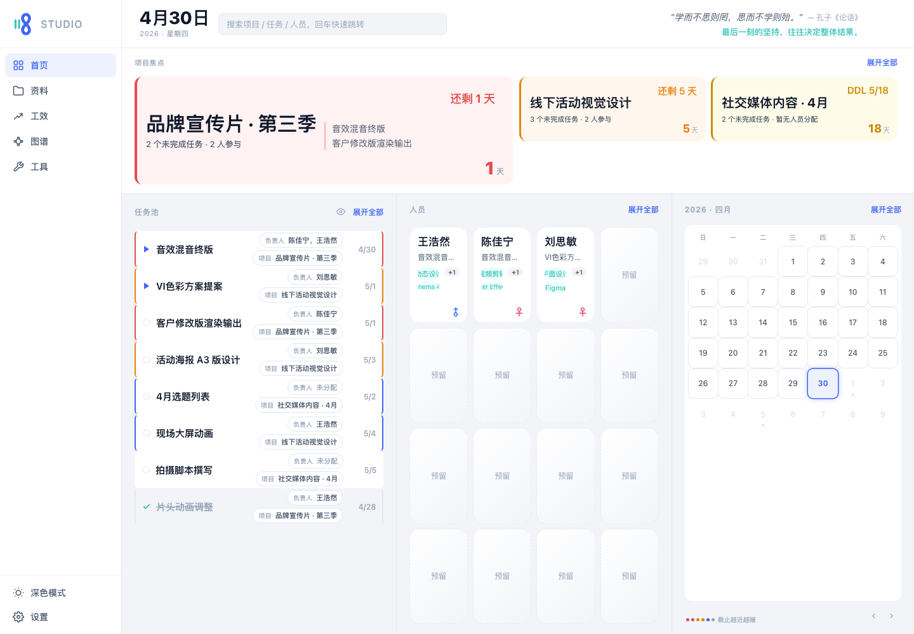 |  |

### 资料

- 甲方要求：记录核心需求、风格偏好、禁忌事项和参考资料。
- 账号密码：按文件夹管理共享账号，支持新建、改名、换色、移动和删除。
- 账号字段可一键复制，适合集中维护平台登录、素材站和工具站信息。

| 浅色 | 深色 |
|---|---|
| 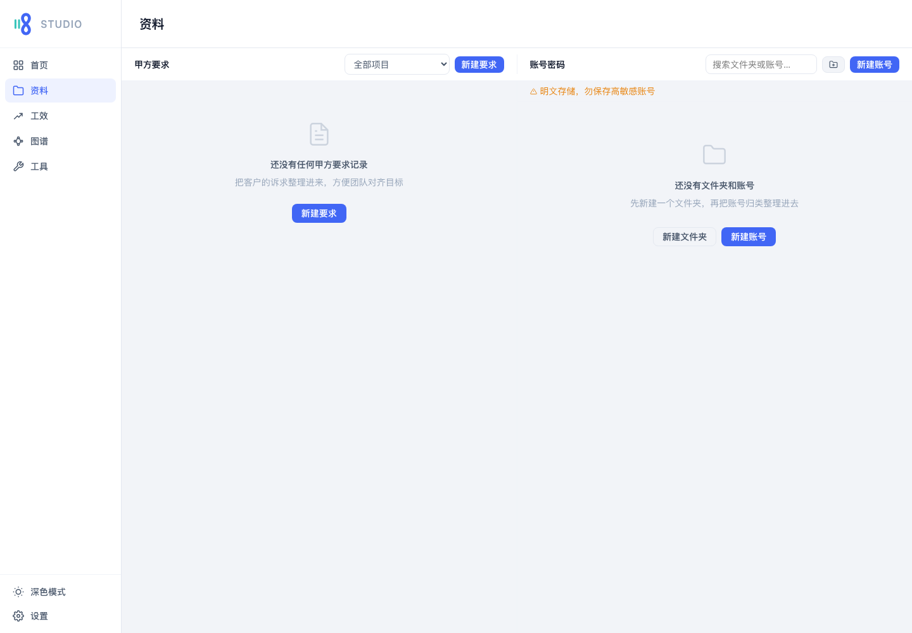 | 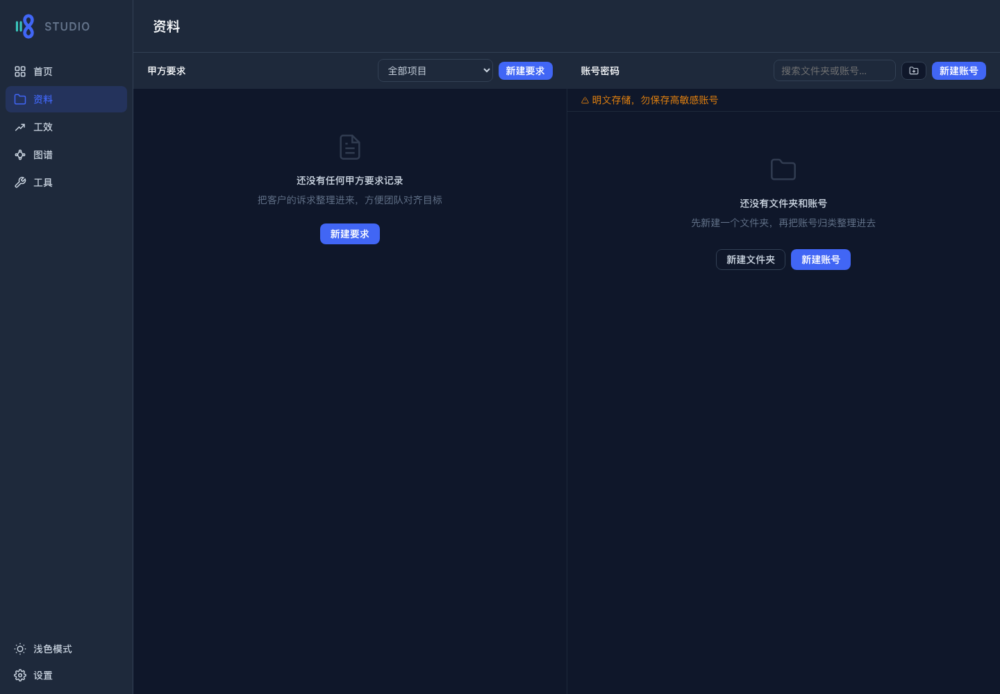 |

### 工效

- 人员工效卡：结合任务、排期和状态查看成员当前负载。
- 课表视图：支持导入课程表 PDF、手动添加课程、按成员筛选、按学期周查看。
- 课表数据会进入完整备份和云同步集合。

| 浅色 | 深色 |
|---|---|
| 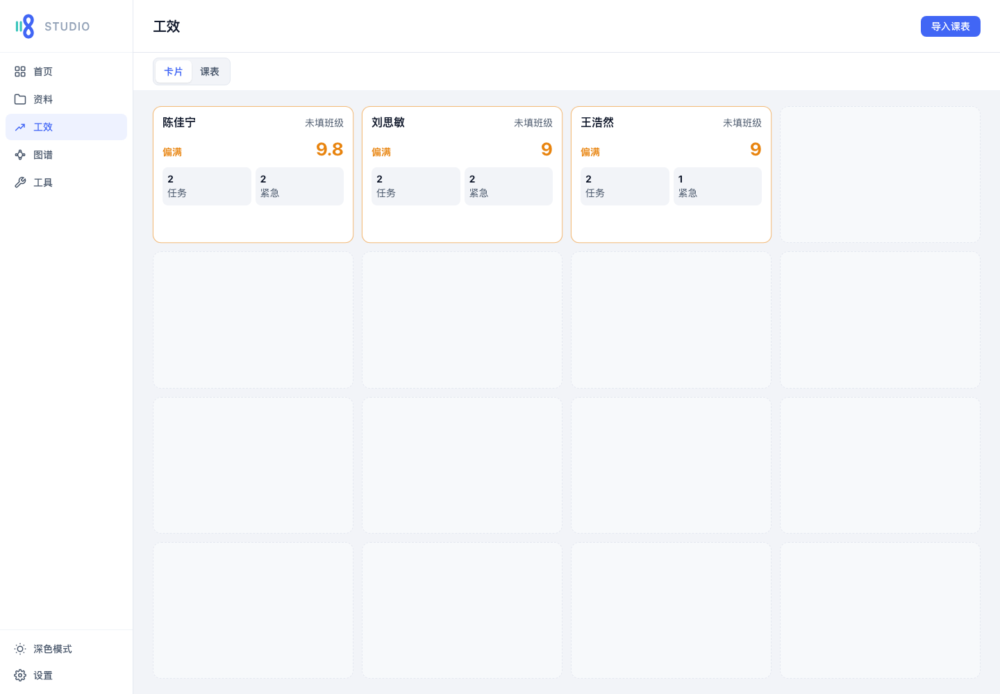 | 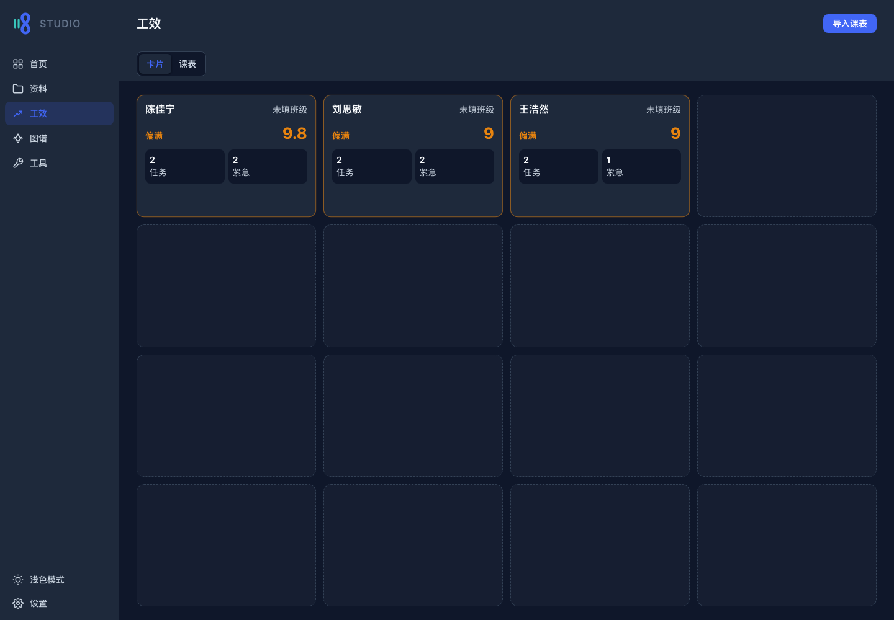 |

### 图谱

- 基于项目、任务和人员生成关系图。
- 支持全部关系、项目任务、任务人员等范围切换。
- 支持力导向、环形、分栏布局，以及搜索、聚焦、缩放、拖拽和详情侧栏。

| 浅色 | 深色 |
|---|---|
| 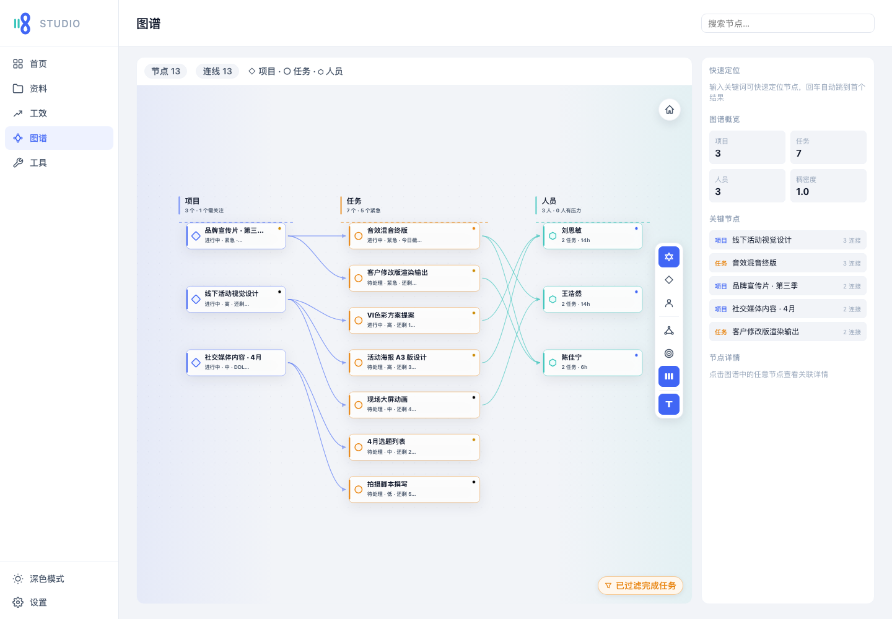 | 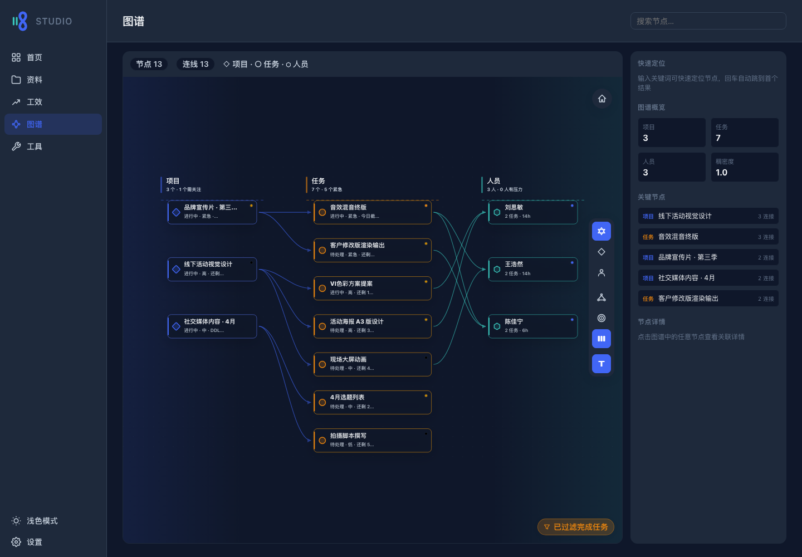 |

### 工具

- 收集常用灵感、视频、音效、字体、压图、转码、全景和模型相关工具。
- 卡片以短功能词呈现，点击后在新窗口打开外部工具。

| 浅色 | 深色 |
|---|---|
| 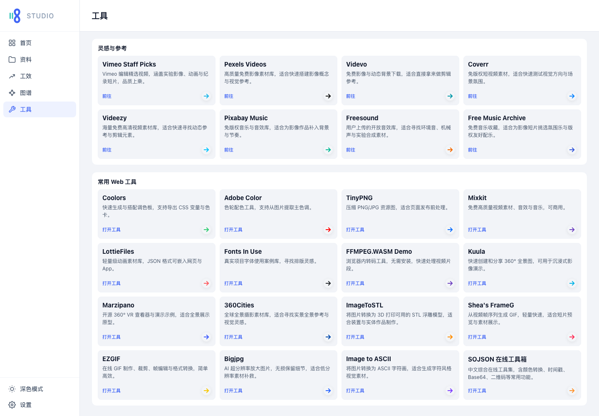 | 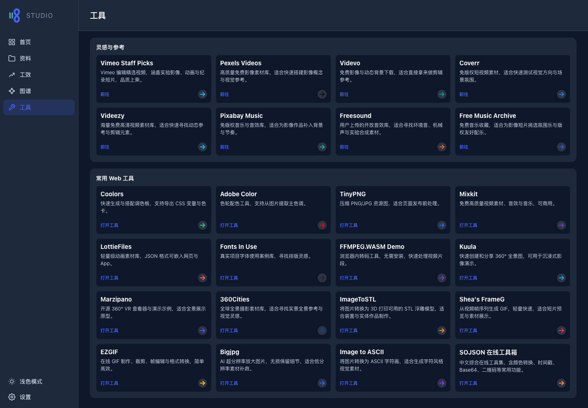 |

### 设置

- JSON 完整导出/导入，项目和任务 CSV 导出。
- 可选 Cloudflare Worker 云同步、手动同步并备份、云端恢复本地。
- 当前数据摘要覆盖项目、任务、人员、日志、设置、请假和课表。
- 最近操作支持可撤回编辑；清空数据等危险操作会二次确认。

| 浅色 | 深色 |
|---|---|
| 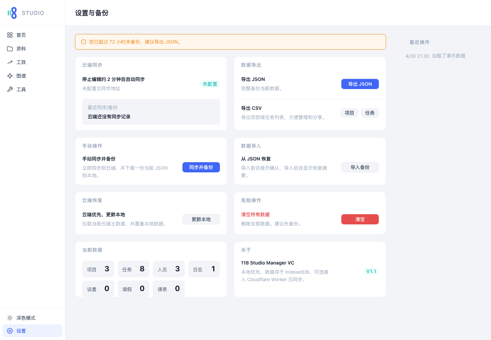 | 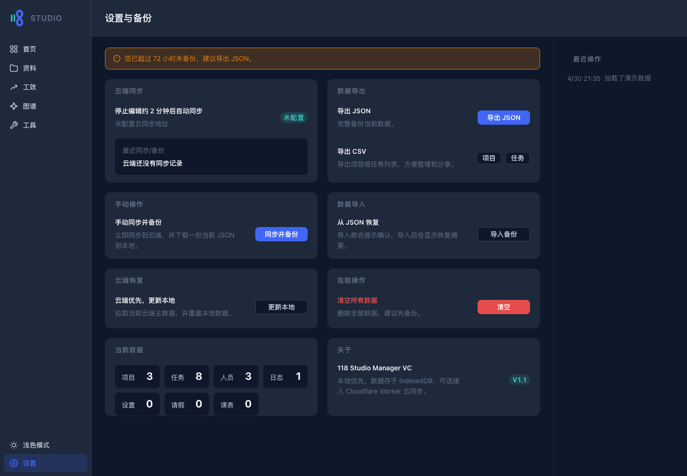 |

---

## 数据与备份

所有业务数据保存在 IndexedDB 数据库 `studio118db`。

| Store | 用途 |
|---|---|
| `projects` | 项目名称、状态、优先级、截止日期和描述 |
| `tasks` | 任务标题、负责人、排期、状态、优先级和工时 |
| `people` | 成员信息、班级/学号/邮箱、技能、状态和备注 |
| `logs` | 导入、导出、同步等操作记录 |
| `settings` | 可同步的视图状态、资料、账号、文件夹和界面记忆 |
| `leaveRecords` | 人员请假日期 |
| `classSchedules` | 工效课表数据 |

当前备份 schema：

```jsonc
{
  "schemaVersion": 4,
  "exportedAt": "2026-04-30T12:00:00.000Z",
  "projects": [],
  "tasks": [],
  "people": [],
  "logs": [],
  "settings": [],
  "leaveRecords": [],
  "classSchedules": []
}
```

`BACKUP_COLLECTION_NAMES` 是导出、导入、清空和云同步的注册中心。新增 IndexedDB store 时，需要同步更新：

- `src/legacy/db.ts`
- `src/legacy/utils.ts`
- `src/legacy/selectors.ts`
- `src/features/settings/settingsTransferState.ts`

---

## 云同步

云同步是可选能力，不影响本地使用。当前同步模型是小团队备份式同步，不是实时协同系统。

配置后会启用：

- 本地编辑后的延迟自动同步
- 手动同步并下载本地 JSON 备份
- 远端元数据轮询
- 从云端快照恢复本地 IndexedDB

Worker 接口：

```text
GET /meta
GET /data
PUT /data
```

部署说明见 [cloudflare/sync-worker/README.md](cloudflare/sync-worker/README.md)。生产鉴权边界依赖 Cloudflare Access；公开仓库文档不要写入真实生产域名。

---

## 技术栈

| 层级 | 技术 |
|---|---|
| UI | React 19 + TypeScript |
| 构建 | Vite 8 |
| 样式 | 原生 CSS + CSS variables |
| 本地存储 | IndexedDB |
| PDF 解析 | `pdfjs-dist` |
| 可选同步 | Cloudflare Worker + KV |
| 测试 | Vitest + jsdom、Playwright |
| 代码检查 | ESLint |
| 部署 | 静态托管 |

---

## 项目结构

```text
src/
├── App.tsx                     # 应用壳、主题、导航和 hash 路由
├── views/                      # 首页、资料、工效、图谱、工具、设置
├── features/                   # 各业务域组件和状态工具
├── components/                 # 通用弹窗、反馈、菜单和头像组件
├── content/                    # 固定内容
└── legacy/
    ├── store.ts                # 内存实体状态与订阅
    ├── actions.ts              # 新增、编辑、删除、导入、导出和撤回
    ├── selectors.ts            # 页面展示模型和备份摘要
    ├── db.ts                   # IndexedDB 读写和迁移
    └── utils.ts                # 日期、备份、CSV 和格式化工具
```

当前主导航只暴露 6 个入口：`dashboard`、`materials`、`productivity`、`graph`、`tools`、`settings`。旧 hash `#people` 会转到图谱，`#calendar` 会转到首页。

---

## 本地运行

项目使用 Volta 固定 Node 和 npm 版本：

```text
Node.js 24.14.1
npm 11.11.0
```

安装依赖并启动：

```bash
npm install
npm run dev
```

默认本地地址：

```text
http://127.0.0.1:5173/
```

macOS 和 Windows 启动脚本：

```bash
./118-start.command
```

```cmd
118-start.cmd
```

---

## 构建与测试

每次修改后需要通过：

```bash
npm run test
npm run build
```

可选检查：

```bash
npm run lint
npm run test:e2e
npm run preview
```

现有测试覆盖同步、数据库迁移、资料文件夹排序、Dashboard 面板、图谱布局、课表解析、设置转移状态、当前应用回归和彩蛋模式。

---

## 部署

这是一个静态 Vite 应用，可部署到 GitHub Pages、Cloudflare Pages、Vercel 或任意静态托管服务。

子目录部署：

```bash
DEPLOY_BASE=/vc/ npm run build
```

启用云同步时，在构建环境中提供：

```bash
VITE_SYNC_API_URL=https://your-worker.example.com
```

GitHub Pages 部署时，可把 `VITE_SYNC_API_URL` 放在 GitHub Actions 变量中。不要把真实生产域名直接写进公开 README。
