# 118 Studio Manager VC

[](https://github.com/fishknowsss/118-Studio-Manager/actions/workflows/deploy.yml)

118 Studio Manager VC 是一个面向小型视频、设计和内容团队的本地优先工作台。项目、任务、人员、甲方资料、工效课表、短剧制作和备份恢复都集中在同一个浏览器应用中；没有配置云端服务时也可以完整使用。

当前版本：`v1.3.1`。业务数据默认保存在当前浏览器的 IndexedDB；需要跨设备备份时，可选接入受 Cloudflare Access 保护的同步 Worker。

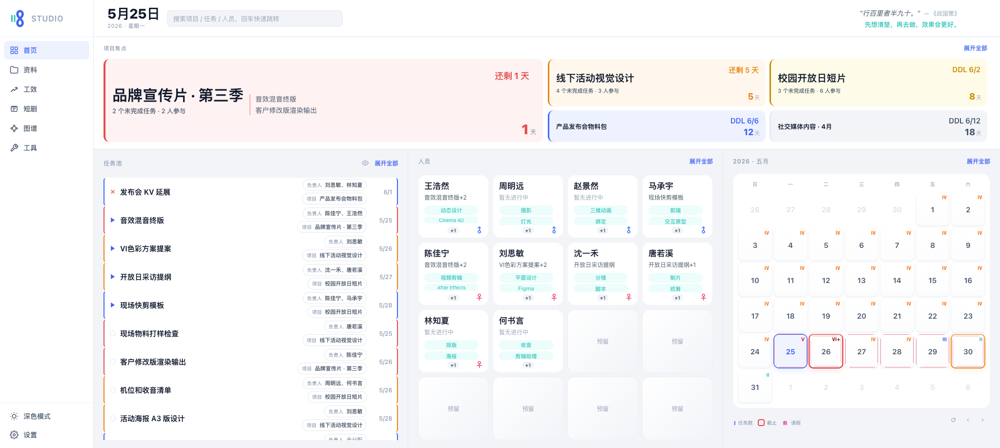

## 项目定位

这个项目解决的是小团队日常制作中的几个具体问题：

- 今天最该处理哪个项目，哪些任务受阻、临期或无人推进。
- 成员当前在做什么、负载如何、具备哪些技能、什么时候有课或请假。
- 甲方需求、参考链接、共享账号和交付禁忌放在哪里查。
- 短剧分集如何分组、分人、记录工时与审核状态。
- 本地数据如何导出、恢复，以及如何做低并发的小团队云端备份。

它不是通用 OA，也不是多人实时协同系统。当前设计更重视单页可读性、低操作成本、本地可用和小团队可恢复性。

## 核心功能

| 模块 | 主要能力 |
|---|---|
| 首页 | 项目焦点时间轴、任务池、人员状态、迷你日历、全局搜索和快速详情 |
| 项目工作台 | 按风险与推进状态分组，查看下一步、进度、交付时间，直接打开、编辑或调整状态 |
| 项目详情 | 项目阶段、行动摘要、风险、任务进度、排期、备注与负责人集中处理 |
| 资料 | 甲方核心需求、风格偏好、禁忌、参考链接，以及共享账号与文件夹管理 |
| 工效 | 成员负载卡、任务压力、完整技能信息、课表 PDF 导入、周课表与课程管理 |
| 短剧 | 剧目、制作小组、分集任务、负责人、工时、成片时长和审核状态 |
| 图谱 | 项目—任务—人员关系图、搜索、聚焦、缩放、拖拽和多种布局 |
| 工具 | 视频、音效、字体、配色、压图、转码、全景与模型工具入口 |
| 设置 | JSON/CSV 导入导出、手动同步、云端恢复、数据摘要和危险操作确认 |

## 主要工作流

### 1. 从首页判断当天重点

首页把项目、任务、人员和日期放在同一屏：

- 项目焦点按开工、审查、交付和结束日期绘制时间轴，并显示当前进度与风险。
- 任务池优先呈现受阻、进行中和待办事项，可快速编辑负责人、状态和优先级。
- 人员卡显示当前任务与技能，不用进入详情才能判断适配度。
- 迷你日历同时标识任务量、截止、请假和当前日期。

### 2. 从项目焦点进入工作台

点击“项目焦点”会打开项目工作台。项目按“需要关注、正在推进、等待安排、已结束”分组，首屏直接给出下一步、受阻/逾期信号、任务进度和交付时间，避免在重复卡片与时间轴之间切换。

| 项目工作台 | 项目详情 |
|---|---|
| 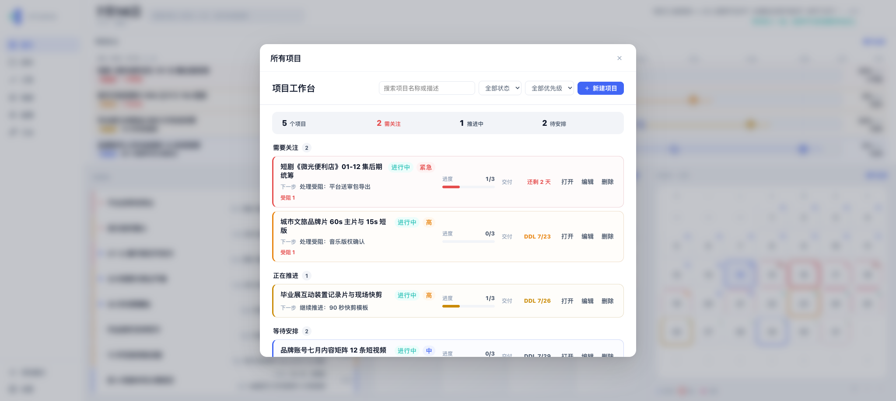 | 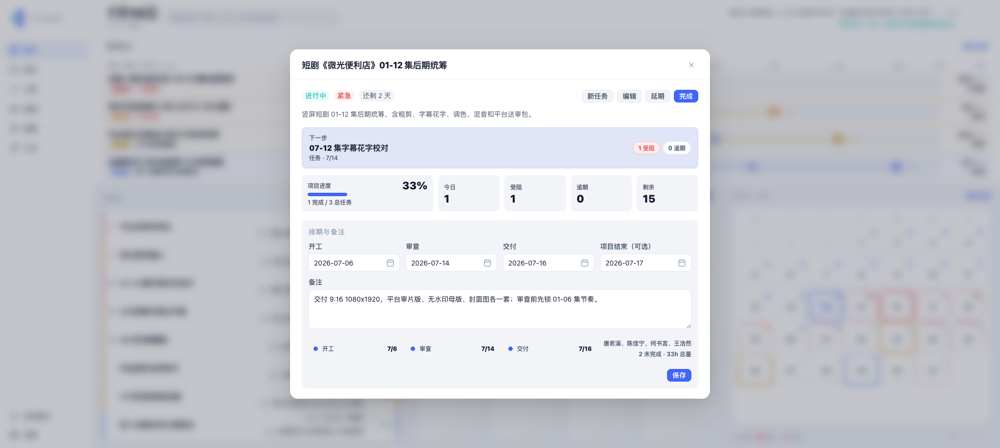 |

项目详情用于实际推进：新建任务、修改项目、延期或完成项目，维护开工/审查/交付日期，查看下一步、风险和任务清单。

### 3. 从人员负载安排任务

工效卡根据任务数量、优先级、状态与工时形成负载结果，并保留成员的完整技能、班级、学号和邮箱信息。课表视图支持按周、按成员查看，也可以导入课程表 PDF 或手动维护课程。

| 人员工效 | 周课表 |
|---|---|
| 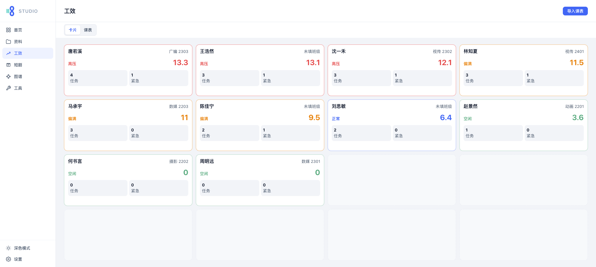 | 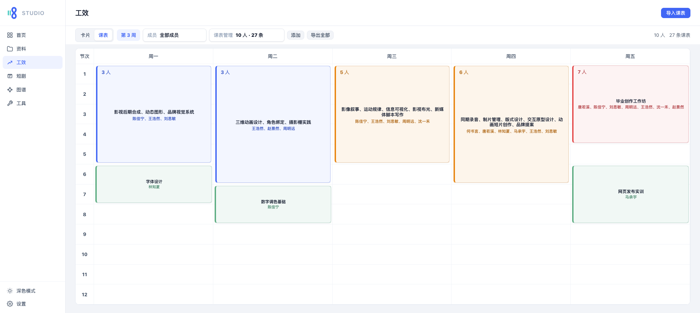 |

### 4. 管理制作资料与专项流程

| 甲方资料与共享账号 | 短剧制作 |
|---|---|
| 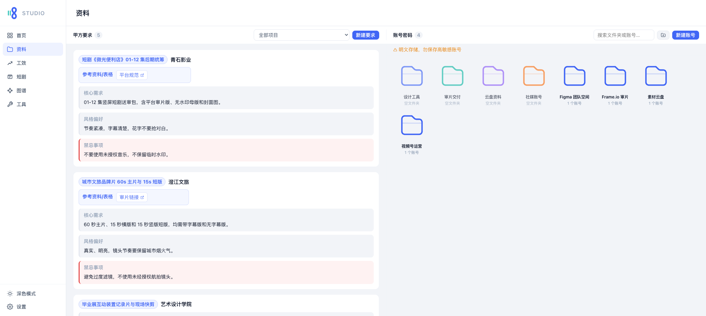 | 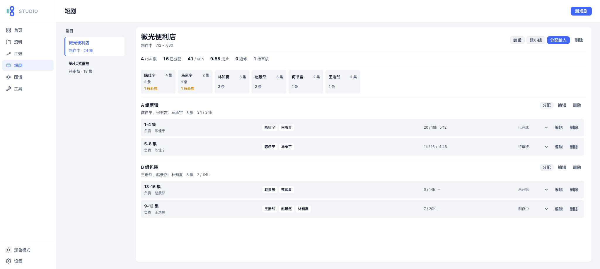 |

- 资料页左侧管理项目要求，右侧按文件夹整理共享账号；账号字段可复制，但仍按明文业务数据保存。
- 短剧页以剧目为入口，进一步拆分制作小组和分集任务，记录负责人、预计/实际工时、成片时长与制作状态。

### 5. 查看关系与完成备份

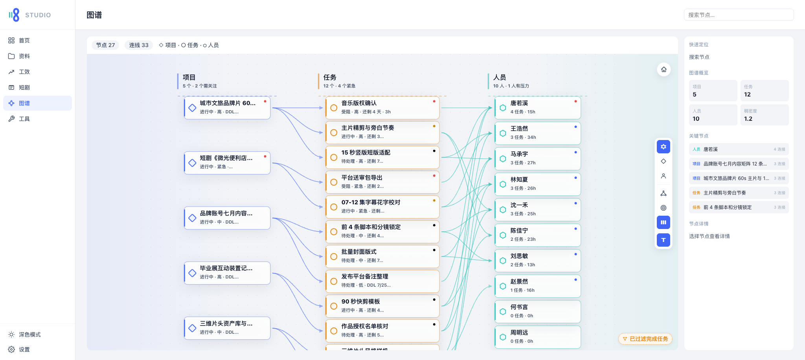

图谱支持全量关系、项目与任务、任务与人员三种范围，以及动态力导、同心分层和分组泳道布局。可以隐藏已完成任务，聚焦某个节点并查看直接关联对象。

| 常用工具 | 设置与备份 |
|---|---|
| 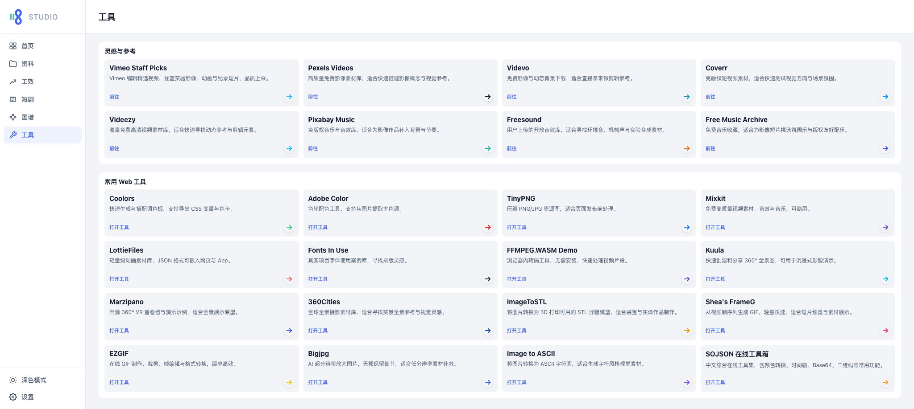 | 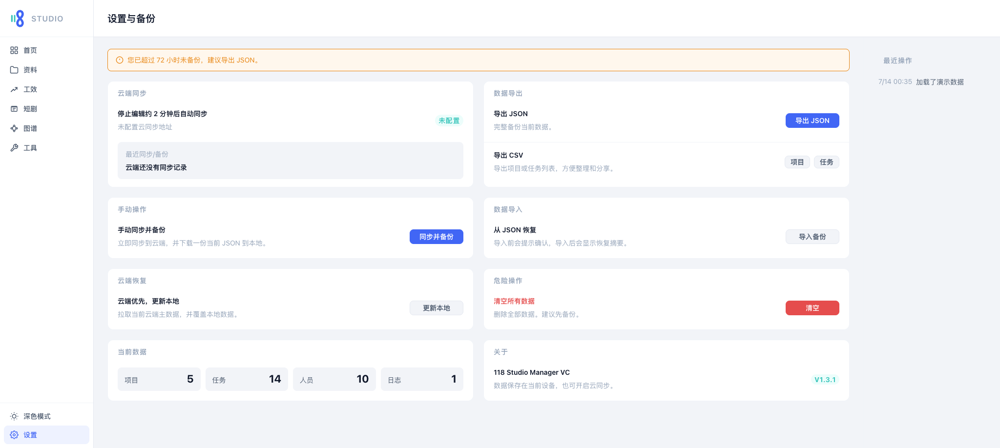 |

## 响应式与主题

桌面端以信息密度和同屏决策为主；窄屏下，项目工作台会改为单列卡片，筛选和操作保持可用。浅色、深色主题使用同一套语义色和状态信息。

| 深色首页 | 移动端项目工作台 |
|---|---|
| 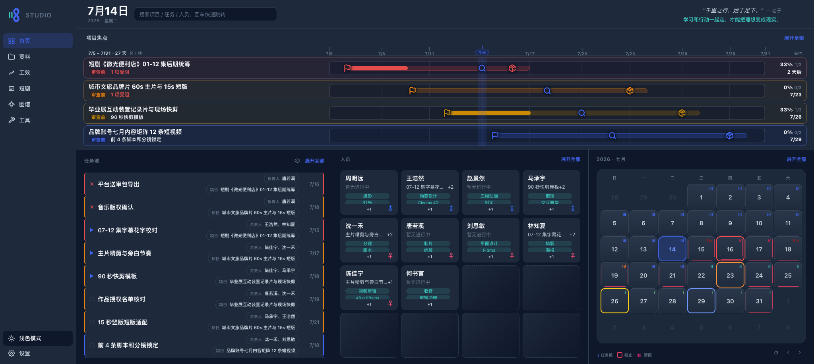 | 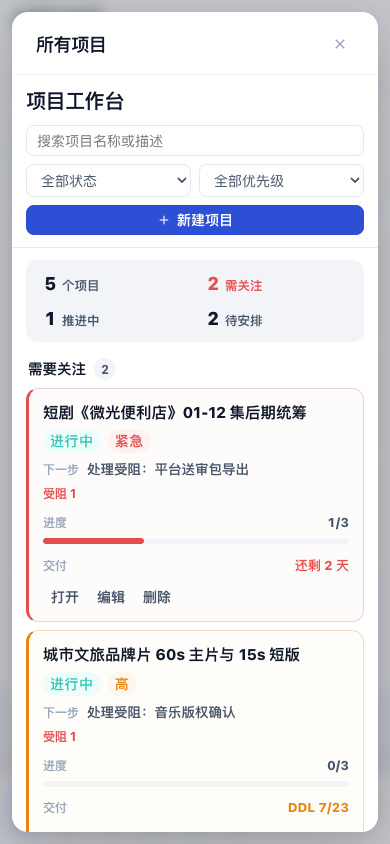 |

以上截图于 2026-07-14 使用当前 `v1.3.1` 代码和首启演示数据实拍。桌面截图为 `2048 × 918`，移动端截图为 `390 × 844`。

## 数据与启动行为

核心业务数据保存在 IndexedDB 数据库 `studio118db`。当前数据库版本为 `6`，备份 schema 版本为 `5`。

| Store | 内容 |
|---|---|
| `projects` | 项目名称、状态、优先级、阶段日期、描述与备注 |
| `tasks` | 项目归属、负责人、状态、优先级、排期与工时 |
| `people` | 成员信息、技能、状态和联系方式 |
| `logs` | 导入、导出、同步等关键操作记录 |
| `settings` | 可同步设置、资料、共享账号、文件夹和界面状态 |
| `leaveRecords` | 成员请假日期 |
| `classSchedules` | 成员课表与课程周次 |
| `shortDramas` | 短剧剧目信息 |
| `shortDramaGroups` | 短剧制作小组 |
| `shortDramaAssignments` | 分集任务、人员分配、工时与状态 |

启动时按以下顺序处理数据：

1. 打开 IndexedDB 并加载本地数据。
2. 本地已有内容时，直接使用本地数据。
3. 本地为空且配置了云同步时，在没有待上传本地变更的前提下尝试恢复云端快照。
4. 本地为空且没有配置云同步时，写入演示数据，方便直接查看完整界面。

`BACKUP_COLLECTION_NAMES` 是导出、导入、清空与云同步的集合注册中心。新增 IndexedDB store 时，必须同步更新：

- `src/legacy/db.ts`：创建 store，并升级 `DB_VERSION`。
- `src/legacy/utils.ts`：扩展 `BackupPayload` 和 `BACKUP_COLLECTION_NAMES`。
- `src/legacy/selectors.ts`：扩展 `BackupSummary` 与摘要构建逻辑。
- `src/features/settings/settingsTransferState.ts`：扩展持久化传输摘要。

遗漏其中任何一处，都可能导致新集合没有进入备份或云同步。

## 本地优先与云端备份

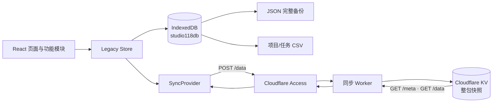
```mermaid
flowchart LR
    A[React 页面与功能模块] --> B[Legacy Store]
    B --> C[(IndexedDB\nstudio118db)]
    C --> D[JSON 完整备份]
    C --> E[项目/任务 CSV]
    B --> F[SyncProvider]
    F -->|POST /data| G[Cloudflare Access]
    G --> H[同步 Worker]
    H --> I[(Cloudflare KV\n整包快照)]
    I -->|GET /meta · GET /data| H
    H --> G
    G --> F
```

云同步是可选能力：

- 本地变更停止约 2 分钟后自动推送。
- 每 10 分钟检查远端元数据，页面重新可见时也会检查。
- 手动同步会先推送当前快照，再下载一份本地 JSON 备份。
- 云端恢复会把当前远端主快照导入本地 IndexedDB。
- Worker 对当前备份 schema 做完整校验，单次快照上限为 5 MiB。

当前同步定位是小团队备份式同步，不是实时协同。同步单位仍是完整快照，适合低并发、可沟通的团队使用；如需多人同时编辑，应先补冲突提示与恢复路径，再评估增量同步或更重的协同方案。

### 安全边界

- 生产主站与同步自定义域名都应由 Cloudflare Access 保护。
- 同步 Worker 使用 Custom Domain；Worker routes 为空不等于没有部署。
- 应关闭 `workers.dev` 等可绕过 Access 的备用入口。
- `ALLOWED_ORIGIN` 只限制浏览器 CORS，不是身份认证。
- 部署后必须用未登录会话验证 `/meta` 与 `/data` 无法直接读取同步数据。
- `settings` 中的共享账号按明文保存，并会进入 JSON 备份和可选云同步；不要保存高敏账号。
- 公开仓库中的域名、KV ID 和其他基础设施信息一律使用占位值。

更完整的评审口径见 [云同步背景说明](docs/cloud-sync-context.md)，Worker 部署步骤见 [同步 Worker 文档](cloudflare/sync-worker/README.md)。

## 技术架构

| 层级 | 实现 |
|---|---|
| UI | React 19、TypeScript 6、Lucide React |
| 构建 | Vite 8 |
| 样式 | 原生 CSS、CSS variables、`data-theme` 主题 |
| 状态 | 观察者模式 Legacy Store + 功能域状态模块 |
| 本地存储 | IndexedDB |
| PDF | `pdfjs-dist`，用于课表解析 |
| 云端备份 | Cloudflare Worker + KV + Cloudflare Access |
| 单元与组件测试 | Vitest + jsdom |
| 端到端测试 | Playwright |
| 代码检查 | ESLint |
| 前端发布 | GitHub Actions + GitHub Pages |

### 代码分层

```text
src/
├── App.tsx                     # 应用壳、主题、主导航与 hash 路由
├── views/                      # 首页、资料、工效、短剧、图谱、工具、设置
├── features/                   # dashboard、projects、sync 等业务功能域
├── components/
│   ├── ui/                     # Dialog、DatePicker、ContextMenu 等通用组件
│   ├── feedback/               # Toast 与确认操作
│   └── easter/                 # 独立彩蛋组件
├── content/                    # 固定内容
└── legacy/
    ├── store.ts                # 内存实体状态、订阅与写入屏障
    ├── actions.ts              # 新增、编辑、删除、导入、导出与撤回
    ├── selectors.ts            # 页面展示模型、项目工作台与备份摘要
    ├── db.ts                   # IndexedDB 打开、迁移、事务与导入导出
    ├── utils.ts                # 日期、备份校验、CSV 和 URL 处理
    └── editUndo.ts             # 最近编辑撤回

cloudflare/sync-worker/
├── src/index.js                # /meta、/data 与快照校验
└── wrangler.example.toml       # 可公开的部署配置模板

tests/
├── *.test.ts(x)                # 数据层、状态、组件与回归测试
├── e2e/                        # 导航和工效课表真实浏览器测试
└── fixtures/                   # 课表 PDF 样本
```

主导航公开 7 个入口：`dashboard`、`materials`、`productivity`、`shortDrama`、`graph`、`tools`、`settings`。历史 hash `#people` 会转到图谱，`#calendar` 会转到首页。

## 本地开发

项目通过 `.nvmrc` 和 Volta 固定运行环境：

```text
Node.js 24.14.1
npm 11.11.0
```

安装并启动：

```bash
npm ci
npm run dev
```

默认地址为 `http://127.0.0.1:5173/`。也可以使用启动脚本：

```bash
./118-start.command
```

```cmd
118-start.cmd
```

### 常用命令

| 命令 | 作用 |
|---|---|
| `npm run dev` | 启动 Vite 开发服务器 |
| `npm run build` | TypeScript 检查并生成生产构建 |
| `npm run test` | 运行 Vitest 单元与组件测试 |
| `npm run test:e2e` | 运行 Playwright 端到端测试 |
| `npm run lint` | 运行 ESLint |
| `npm run check:worker` | 对同步 Worker 做 Wrangler dry-run |
| `npm run check` | 依次运行 lint、unit、build 与 Worker dry-run |

测试覆盖数据库迁移、备份输入校验、批量写入与持久化屏障、启动并发、同步客户端与 Provider、Worker 接口、项目工作台、弹窗行为、外链校验、资料文件夹、工效课表、图谱布局、短剧模型、主题和主要页面导航。

## 部署

### 前端

`.github/workflows/deploy.yml` 会在 `main`、`singleD` 和 `vc` 分支 push 时执行完整检查，随后构建并发布 GitHub Pages：

| 分支 | 构建基础路径 | 发布位置 |
|---|---|---|
| `vc` | `/` | 站点根目录 |
| `main` | `/118-Studio-Manager/v1/` | `v1` 子目录 |
| `singleD` | `/118-Studio-Manager/singleD/` | `singleD` 子目录 |

构建环境可配置：

```bash
DEPLOY_BASE=/ npm run build
```

启用同步时，在部署平台设置变量，不要写入仓库：

```bash
VITE_SYNC_API_URL=https://sync.example.com
```

### 同步 Worker

复制公开模板，填写本地生产配置：

```bash
cp cloudflare/sync-worker/wrangler.example.toml \
  cloudflare/sync-worker/wrangler.local.toml
```

`wrangler.local.toml` 需要配置 Worker 名称、KV Namespace、自定义域名和 `ALLOWED_ORIGIN`。该文件已被 `.gitignore` 排除，不应提交。

先验证，再部署：

```bash
npm run check:worker
npx wrangler deploy \
  --config cloudflare/sync-worker/wrangler.local.toml
```

部署完成后还需要核验 Cloudflare Access、自定义域名、`workers.dev` 入口和匿名访问结果；仅看到 Wrangler 部署成功不代表鉴权边界已经正确。

## 数据使用提醒

- IndexedDB 数据按浏览器 origin 隔离；更换域名、浏览器配置或清理站点数据前先导出 JSON。
- JSON 是完整恢复文件，CSV 仅用于整理项目或任务列表，不能替代完整备份。
- 导入、云端恢复和清空数据都会改变本地状态，界面会在执行前要求确认。
- 演示数据只用于首次体验，不应混入真实项目备份。
